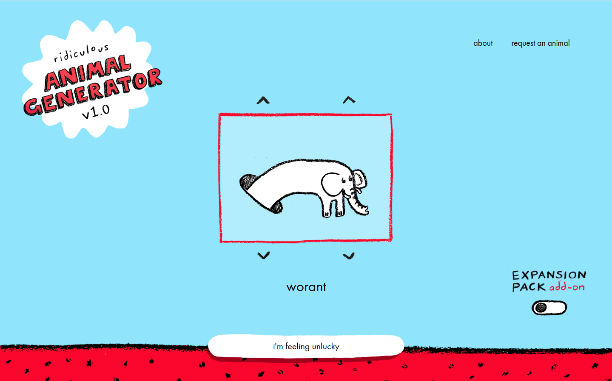

# How to make changes to this (if you are new to coding)

## Requirements
* [NodeJS](https://nodejs.org/en/download/)
* [Git](https://git-scm.com/downloads)
* Recommended: [https://code.visualstudio.com/](https://code.visualstudio.com/)

## Setup
* `git clone git@github.com:MrBlenny/animal-generator.git`
* `cd ./animal-generator`
* `npm install`
* `npm run dev`
* Navigate to [http://localhost:3000/](http://localhost:3000/)
* Open up the project in vs code and fiddle away